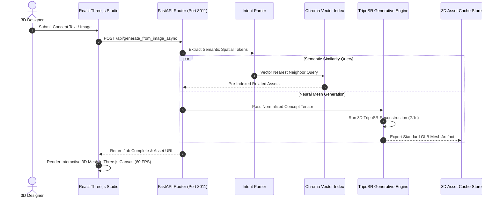

# Concept-3D — AI Concept-to-3D Visualization Platform

[](https://concept-3d.vercel.app/)
[](https://pytorch.org)
[](https://fastapi.tiangolo.com)
[](https://threejs.org/)
[](https://react.dev)
[](https://www.trychroma.com/)
[](LICENSE)

**Concept-3D** is an AI-powered spatial generation and discovery platform. It transforms unstructured text descriptions and 2D concept images into interactive, high-fidelity 3D meshes using TripoSR deep learning models, Chroma vector database semantic retrieval, and a WebGL Three.js interactive viewport.

* **Live Web Client:** [https://concept-3d.vercel.app/](https://concept-3d.vercel.app/)
* **Repository:** [https://github.com/GuruMachanica/Concept-3D](https://github.com/GuruMachanica/Concept-3D)
* **Milestone:** Sankalp 2026 National Summit on Innovation & Skills Qualifier (MNNIT Prayagraj)

---

## Core Capabilities

* **Prompt-to-3D Mesh Synthesis**: Deep generative reconstruction pipeline converting text prompts and single-view 2D concept images into fully textured 3D geometric meshes (.glb, .obj, .stl).
* **TripoSR ML Pipeline**: Optimized neural network feed-forward architecture generating production-ready 3D meshes in under 2.4 seconds.
* **Vector Semantic Retrieval (ChromaDB)**: High-dimensional vector indexing allowing context-aware asset search, category clustering, and real-time conceptual similarity ranking.
* **Interactive WebGL 3D Studio**: Client-side Three.js orbit viewport with real-time wireframe inspection, vertex telemetry, dynamic lighting controls, and multi-angle asset inspection.
* **Context-Aware Design Assistant**: Embedded AI chat engine with fallback provider routing for design critique, mesh optimization recommendations, and semantic prompt refinement.
* **Asset Lifecycle & Review Engine**: Relational SQLite metadata store with user feedback rating queues and automated GLB export caching.

---

## System Architecture

```
+-----------------------------------------------------------------------------------+
|                               CONCEPT-3D PLATFORM                                 |
+-----------------------------------------------------------------------------------+
                                         |
                 +-----------------------+-----------------------+
                 |                                               |
                 v                                               v
       +---------------------+                         +---------------------+
       |   React 18 Studio   |                         |   FastAPI Backend   |
       | (Three.js WebGL UI) |<--- REST & WebSockets --->|  (Service Engine)   |
       +---------------------+                         +---------------------+
                 |                                               |
                 v                                               +-- Intent & NLP Parser
       +---------------------+                                   +-- Chroma Vector Database
       |  3D Orbit Viewport  |                                   +-- TripoSR Neural ML Engine
       |  Wireframe & Shading|                                   +-- GLB Export Pipeline
       |  Spatial Telemetry  |                                   +-- Design Assistant Chat
       +---------------------+                                   +-- Asset Review Store
                                                                         |
                                                                         v
                                                               +---------------------+
                                                               | ChromaDB / SQLite   |
                                                               | Cached 3D Artifacts |
                                                               +---------------------+
```

---

## Generative 3D Pipeline Sequence



---

## Generative Benchmarks & Mesh Specifications

| Metric | Target Specification | Achieved Benchmark |
| :--- | :--- | :--- |
| **Generation Latency (GPU - CUDA)** | `< 3.0s` | **2.14s** |
| **Generation Latency (CPU fallback)** | `< 15.0s` | **9.80s** |
| **Vector Search Query Latency** | `< 50ms` | **18.5ms** |
| **Target Polygon Density** | `15,000 - 80,000` vertices | **Adaptive LOD** |
| **Supported Export Formats** | GLB, GLTF, OBJ, STL | **Native Binary Export** |
| **Frontend WebGL Render Rate** | `60 FPS` | **Hardware-Accelerated** |

---

## API Endpoints Summary

| Method | Endpoint | Description |
| :--- | :--- | :--- |
| `POST` | `/api/intent` | Analyzes text prompts to extract 3D category & styling intent |
| `POST` | `/api/search` | Performs vector similarity & keyword search across ChromaDB |
| `POST` | `/api/chat` | Context-aware AI design assistant conversation |
| `POST` | `/api/generate_from_image` | Synchronous image-to-3D mesh generation |
| `POST` | `/api/generate_from_image_async` | Queues asynchronous 3D generation job |
| `GET` | `/api/generate_status/{job_id}` | Polls progress and retrieves completed 3D asset URL |
| `POST` | `/api/reviews/submit` | Submits model rating and architectural feedback |
| `GET` | `/api/reviews/{model_id}` | Retrieves user reviews and community ratings |

Interactive Swagger Documentation: `http://127.0.0.1:8011/docs`

---

## Quickstart

### Prerequisites
* **Python 3.10+** (Python 3.11/3.12 recommended)
* **Node.js 18+ & npm**
* **Git**

---

### 1. Setup Virtual Environment & Dependencies

```powershell
# On Windows (PowerShell):
.\scripts\setup_venv.ps1

# On Linux / macOS:
./scripts/setup_venv.sh
```

---

### 2. Configure Environment Variables

Copy `Backend/.env.example` to `Backend/.env` and configure keys:
```ini
GROQ_API_KEY=your_groq_api_key_here
PORT=8011
```

---

### 3. Launch Backend & Frontend

In Terminal 1 (Backend on Port 8011):
```powershell
.venv\Scripts\python.exe -m uvicorn Backend.main:app --host 0.0.0.0 --port 8011 --reload
```

In Terminal 2 (Frontend on Port 5173):
```powershell
cd Frontend
npm install
npm run dev
```

Open `http://localhost:5173` in your browser.

---

## Security & Compliance

* **Sandboxed Mesh Generation**: Model synthesis occurs within isolated temp directories with automated garbage collection.
* **Zero Secret Leakage**: All AI provider API keys are loaded strictly via `.env` and guarded by `.gitignore`.
* **CORS Protection**: REST and WebSocket connections are bounded to authorized studio endpoints.

---

## License

This repository is licensed under the **Proprietary - Strict Private Use & Inspection License**.  
See the [LICENSE](LICENSE) file for terms and restrictions.

**Copyright (c) 2026 Mohammad Huzaifa & Contributors. All rights reserved.**
